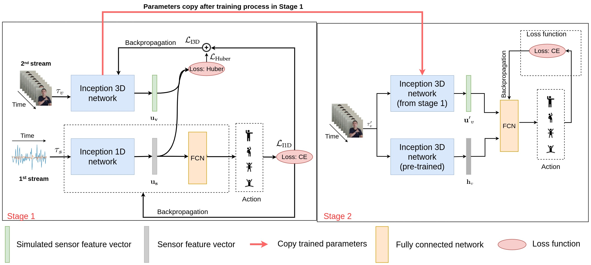

# Sign Language Recognition with Self-learning Fusion Models

## Overview

This repository contains trained models reported in the paper "[Sign Language Recognition with Self-learning Fusion Models]()"

In this paper, we introduced about a new structure for improve the performance of the model video classification on 3 datasets MHAD, UTD-MHAD & our dataset (VSL).

Main idea of this paper, using two network to can make a fusion result to support for improve accuracy of video classification on RGB image. 

In this paper, we also introduced a method self-learning to can create a new second model to can fusion with model video classification base on I3D in paper "[Quo Vadis, Action Recognition? A New Model and the Kinetics Dataset](https://arxiv.org/abs/1705.07750)" by Joao Carreira and Andrew Zisserman. The paper was posted on arXiv in May 2017, and will be published as a
CVPR 2017 conference paper.

Beside that, we also provide a dataset for sign language include: 50 classes with sensor data & video data from 12 people.



## Dataset Requirements 

Our domain want to transfer data from domain into other domain. Specify, we want to transfer domain from video RGB into domain of sensor data (accelerometer, gyroscope). You only have a part of data full of the video and sensor. You can apply our method to can achieve higher accuracy while you only has a quantity full dataset with pair (video-sensor). 

To can use we create a sign language dataset called by "[VSL](https://drive.google.com/drive/folders/1dDf2YsQZaVkjGo5GCNkWJXq6HAZcvSoF?usp=sharing)" 

In our dataset, we has over 5813 pair (video-sensor) using for train, and 2214 pair (video-sensor). In this test dataset we only using video dataset, but the model still can work with perfermance higher two stream OTF & RGB, also only video with backbone is I3D. 

- Each video will covert into array with shape (24, 224, 224, 3)
- Sensor has shape is (n_steps, n_sensors * 3)

## Running the code

To can run code pre-install and follow in bellow guide:

```sh
git clone https://github.com/ngoctuhan/Sign-Language-Recognition-with-Self-learning-Fusion-Models.git
```

On the Linux Os:

```sh
pip3 install -r requirements.txt
```

### Prepare dataset

1. Covert video into array file .npy using: "[utils/videoprocess.py](https://github.com/ngoctuhan/Sign-Language-Recognition-with-Self-learning-Fusion-Models/blob/main/utils/videoprocess.py)".

You must define: number of frames = 24, width = 224, height = 224 (can custom depend your options)

2. Process sensor dataset and save into .npy file.

```diff
- Note: You should naming name of video same with name of video & save into 2 folders.
```
3. Create distribution dataset and save into csv file and put into dataset folder. 

### Training video classification 

```sh
python3 train_video.py --dataset VSL --batch_size 16 --folder .dataset/SignRGB_VSL.npy --epoch 50 --gpu 0 --pretrain False
```

- folder: Folder contains npy file of video RGB
- dataset: name of folder in dataset folder to see distribution dataset

### Training sensor classification

```sh
python3 train_sensor.py --dataset VSL --path_of_dataset .dataset/sensor/VSL --saved checkpoint
```
- saved: path to save checkpoint of model

### Training generator method 

```sh
ython3 training_generator.py --dataset VSL --saved checkpoint --model_path model_sensor_cls.h5 
```

### Validation generator method 


```sh
python3 valid_generator.py --saved checkpoint_of_ep --model_path model_generator.h5 --folder folder_video_VSLRGB
```


## Result


Model          | VSL           | UTD-MHAD     | Berkeley MHAD
-------------- | :-----------: | -----------: | --------------
MARS           | 77.2          |  84.50       | 87.30
Two-Stream I3D | 84.6          |  90.30       | 92.10
SWIN-B         | 71.1          |  81.40       | 84.50
Our method     | 87.1          |  91.90       | 95.60


## Questions and contributions
For any questions, you can contact the authors of the "Sign Language Recognition with Self-learning Fusion Models" paper, whose emails are listed in the paper.

